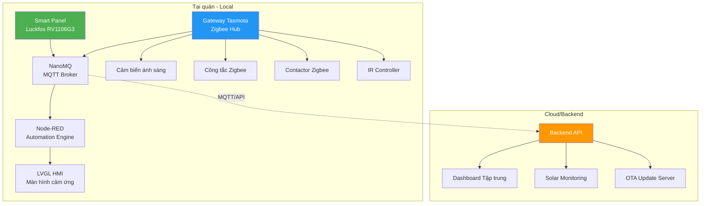

# Slide 1: Tiêu đề & Tổng quan dự án

# Hệ thống Quản trị Năng lượng Smart Cafe

## Giải pháp IoT tiết kiệm năng lượng toàn diện cho chuỗi F&B

---

## Tóm tắt dự án trong 30 giây

- **Tên dự án:** Hệ thống Quản trị Năng lượng Smart Cafe
- **Đối tượng:** Chuỗi cafe & F&B
- **Phạm vi ứng dụng:**
  - Hệ thống điều hòa
  - Hệ thống đèn biển quảng cáo
  - Hệ thống đèn chiếu sáng

---

## Kiến trúc tổng quan

---

## Thiết bị & Công nghệ nổi bật

| Thành phần | Thiết bị/Công nghệ |
|-----------|-------------------|
| **Smart Panel** | Luckfox Core1106 Smart 86 Box (RV1106G3, 1TOPS, 256MB DDR3L) |
| **Gateway** | Hub Ewelink Zigbee Pro (Firmware Tasmota) |
| **Cảm biến** | Cảm biến ánh sáng (pin solar) |
| **Điều khiển** | Công tắc, Contactor, IR Controller (Zigbee) |
| **Phần mềm** | Ubuntu, LVGL, Node-RED, NanoMQ, OTA |

