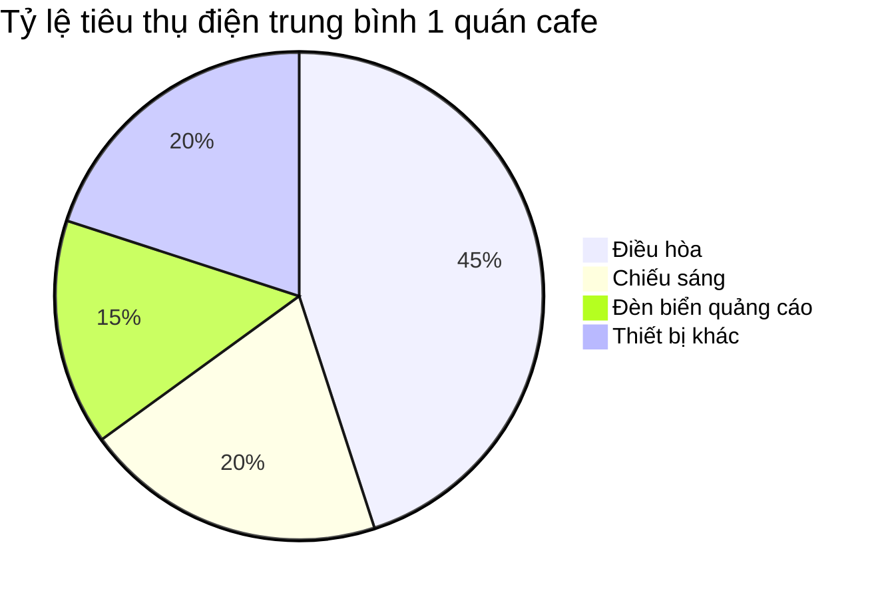
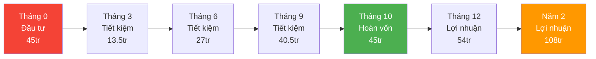
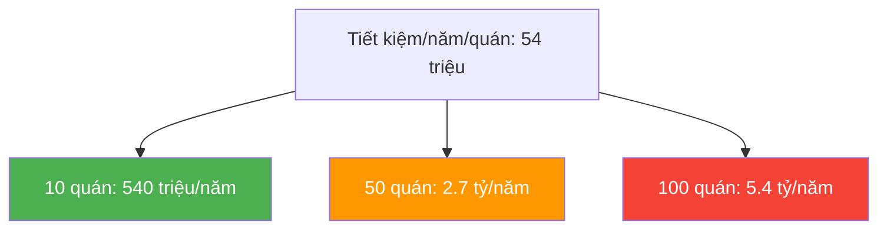

# Slide 2: Ban Giám đốc — ROI

# Chứng minh bài toán ROI: Đầu tư sinh lợi

## Mục tiêu: Cho sếp thấy đây không phải "tiêu tiền" mà là "đầu tư sinh lợi"

---

## Bài toán lãng phí hiện tại

### Điện năng đang "bay" đi đâu?

### Các điểm lãng phí cụ thể

- **Điều hòa:** Chạy suốt 24/7 dù không có khách (chiếm **45%** hóa đơn điện)
  - Không tắt khi đóng cửa
  - Không điều chỉnh nhiệt độ theo giờ cao điểm/thấp điểm
- **Đèn quảng cáo:** Bật 24/7 dù cửa hàng đã đóng (chiếm **15%**)
- **Chiếu sáng:** Không điều chỉnh theo ánh sáng tự nhiên (chiếm **20%**)

---

## Dự báo tài chính chi tiết

### Giả định (1 quán)

| Chỉ số | Giá trị |
|--------|---------|
| Hóa đơn điện trung bình/tháng | ~15 triệu VNĐ |
| Tỷ lệ lãng phí có thể cắt giảm | **~30%** |
| Tiết kiệm/tháng | **~4.5 triệu VNĐ** |
| Chi phí đầu tư 1 bộ (Panel + Gateway + thiết bị) | **~45 triệu VNĐ** |

### Timeline hoàn vốn

### Bảng tổng hợp

| Chỉ số | Con số |
|--------|--------|
| Tỷ lệ tiết kiệm điện | **~30%** |
| Thờigian hoàn vốn | **~10 tháng** |
| Lợi nhuận năm đầu (tháng 11-12) | **~9 triệu** |
| Lợi nhuận năm 2+ | **~54 triệu/năm** |
| Mức độ rủi ro | **Thấp** (không sửa chữa hạ tầng) |

---

## So sánh: Có vs Không hệ thống

| | Không có Smart Cafe | Có Smart Cafe |
|---|-------------------|---------------|
| **Hóa đơn điện/tháng** | 15 triệu | 10.5 triệu |
| **Hóa đơn điện/năm** | 180 triệu | 126 triệu |
| **Tiết kiệm/năm** | 0 | **54 triệu** |
| **5 năm tổng chi phí** | 900 triệu | 675 triệu + 45 triệu = **720 triệu** |
| **Tiết kiệm 5 năm** | 0 | **180 triệu** |

---

## Với quy mô chuỗi

---

## Thông điệp thuyết phục

> *"Hệ thống sẽ tự nuôi chính nó sau chưa đầy 1 năm vận hành, những năm sau đó là lợi nhuận thuần túy cho chuỗi."*

