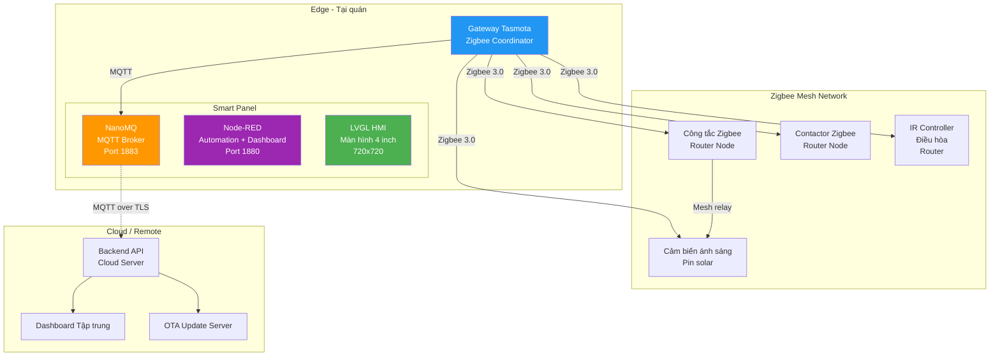
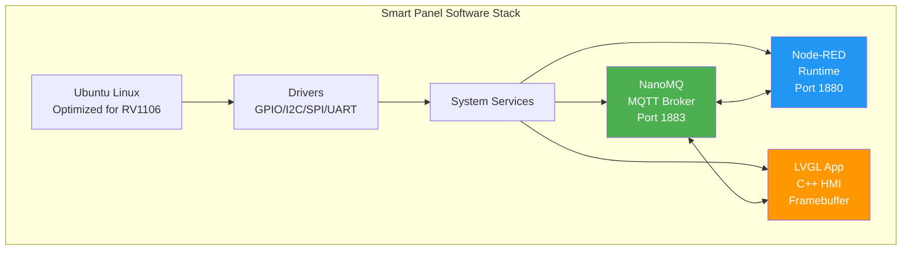
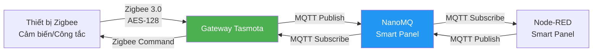
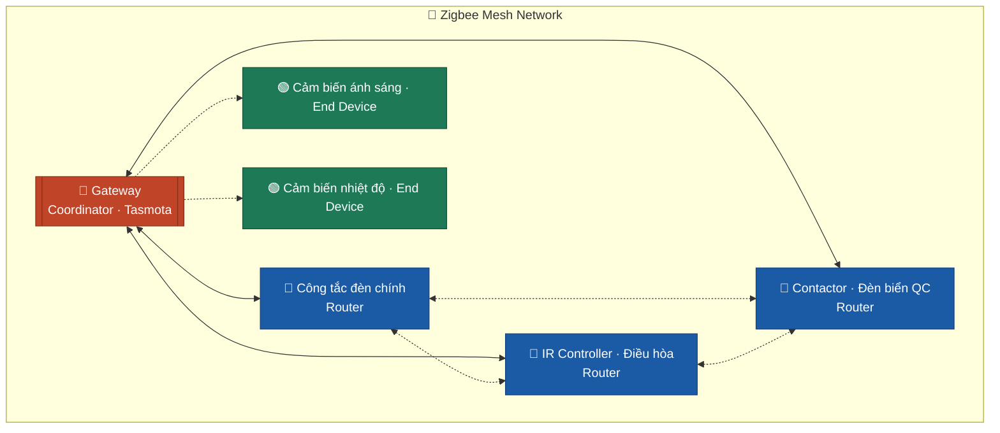
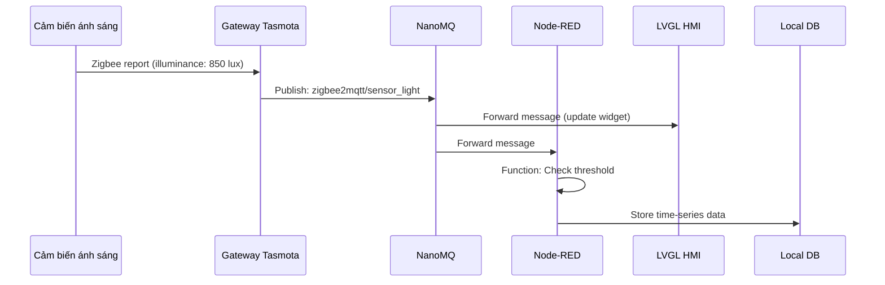
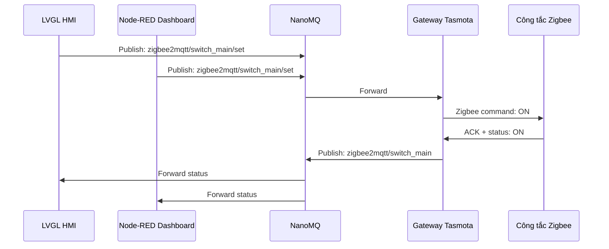
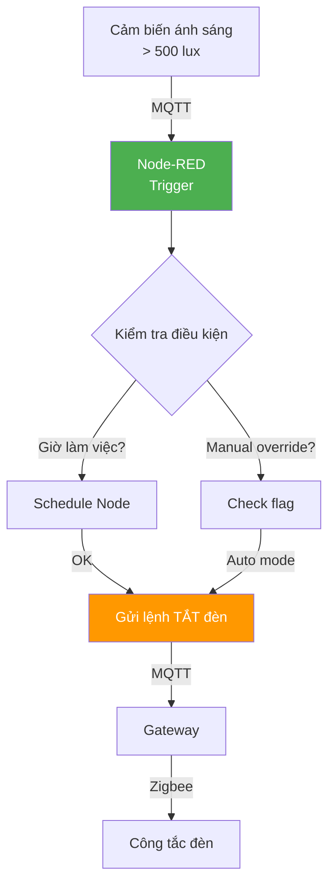
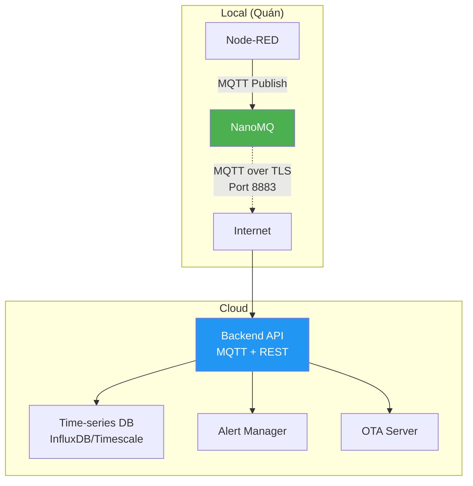

# Slide 2: Tổng quan Kiến trúc Kỹ thuật

# Tech Stack & Kiến trúc Hệ thống Smart Cafe

## Từ cảm biến Zigbee đến Dashboard — Luồng dữ liệu và công nghệ

---

## Kiến trúc Tổng quan (High-level)

---

## 1. Smart Panel — Trung tâm điều khiển Local

### Phần cứng

| Thông số | Giá trị |
|----------|---------|
| **Board** | Luckfox Core1106 Smart 86 Box |
| **SoC** | Rockchip RV1106G3 |
| **NPU** | 1 TOPS (hỗ trợ AI inference) |
| **RAM** | 256MB DDR3L |
| **Màn hình** | 4 inch, cảm ứng điện dung, 720x720 |
| **Storage** | eMMC / microSD |
| **Kết nối** | Ethernet, Wi-Fi, USB OTG |

### Phần mềm Stack

| Thành phần | Vai trò | Lý do chọn |
|-----------|---------|-----------|
| **Ubuntu** | OS nền | Hệ sinh thái rộng, dễ dev, hỗ trợ RV1106 |
| **NanoMQ** | MQTT Broker | Nhẹ, high-performance, phù hợp edge device 256MB RAM |
| **Node-RED** | Automation + Dashboard | Low-code, dễ tùy biến flow, có sẵn MQTT nodes |
| **LVGL** | GUI trên màn hình 4" | C++ native, nhẹ, render nhanh trên embedded |

---

## 2. Gateway Hub — Zigbee Coordinator

### Phần cứng

| Thông số | Giá trị |
|----------|---------|
| **Thiết bị** | Hub Ewelink Zigbee Pro |
| **Flash firmware** | Tasmota (open-source) |
| **Chuẩn Zigbee** | 3.0 |
| **Vai trò** | Zigbee Coordinator + MQTT Bridge |

### Chức năng chính

- **Coordinator:** Quản lý mạng Zigbee, cấp phát địa chỉ, lưu routing table
- **MQTT Bridge:** Chuyển đổi Zigbee message ↔ MQTT topic chuẩn
- **Topic format:**
  - Nhận dữ liệu: `zigbee2mqtt/[device_name]`
  - Gửi lệnh: `zigbee2mqtt/[device_name]/set`

---

## 3. Zigbee Mesh Network

### Phân biệt Router vs End Device

| Loại | Vai trò | Nguồn điện | Thiết bị trong dự án |
|------|---------|-----------|---------------------|
| **Coordinator** | Điều phối toàn mạng | AC adapter | Gateway Tasmota |
| **Router** | Chuyển tiếp (relay) message | AC hard-wired | Công tắc, Contactor, Controller điều hòa |
| **End Device** | Gửi/nhận, không relay | Pin (solar/battery) | Cảm biến ánh sáng, cảm biến nhiệt |

---

## 4. Luồng dữ liệu chi tiết

### 4.1. Thu thập dữ liệu cảm biến

### 4.2. Điều khiển thiết bị

### 4.3. Automation flow (ví dụ: Tự động tắt đèn)

---

## 5. Giao tiếp Cloud/Backend

### Dữ liệu đồng bộ lên Cloud

| Loại dữ liệu | Tần suất | Topic ví dụ |
|-------------|----------|-------------|
| **Telemetry** | 5-15 phút | `cafe/quanA/sensor/light` |
| **Device status** | Real-time | `cafe/quanA/device/switch1/status` |
| **Energy kWh** | 15-30 phút | `cafe/quanA/energy/consumption` |
| **System health** | 30 giây | `cafe/quanA/health/panel` |
| **Alerts** | Real-time | `cafe/quanA/alerts` |

---

## 6. Bảng tổng hợp Tech Stack

| Layer | Công nghệ | Chức năng |
|-------|-----------|-----------|
| **Hardware** | Luckfox Core1106, Ewelink Hub | Edge computing + Zigbee coordinator |
| **OS** | Ubuntu (ARM64) | Nền tảng chạy services |
| **Connectivity** | Zigbee 3.0, MQTT, Wi-Fi, Ethernet | Giao tiếp thiết bị & network |
| **Broker** | NanoMQ | MQTT broker local nhẹ |
| **Automation** | Node-RED | Flow-based programming |
| **UI On-device** | LVGL (C++) | Màn hình cảm ứng 4 inch |
| **UI Web** | Node-RED Dashboard | Quản lý qua browser |
| **Security** | MQTT TLS, Zigbee AES-128 | Mã hóa truyền dữ liệu |
| **Update** | OTA (HTTP + script) | Cập nhật từ xa |

---

## Lợi thế của kiến trúc này

- ✅ **Local-First:** Hoạt động 100% khi mất internet
- ✅ **Nhẹ:** Toàn bộ stack chạy tốt trên 256MB RAM
- ✅ **Mở:** Tasmota + Node-RED = dễ tùy biến, không vendor lock-in
- ✅ **Mesh:** Zigbee tự mở rộng phạm vi, tự phục hồi
- ✅ **Low-code:** Node-RED cho phép thay đổi logic không cần biên dịch
- ✅ **OTA:** Cập nhật firmware và flow từ xa cho cả chuỗi
