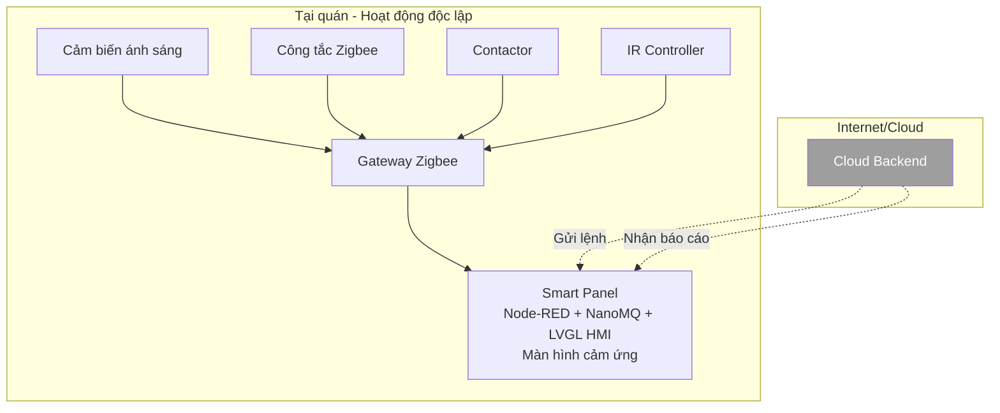
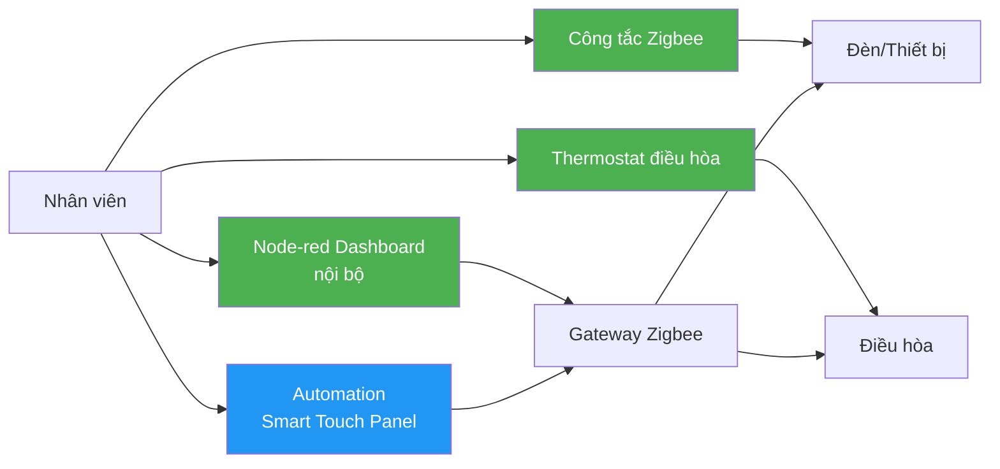
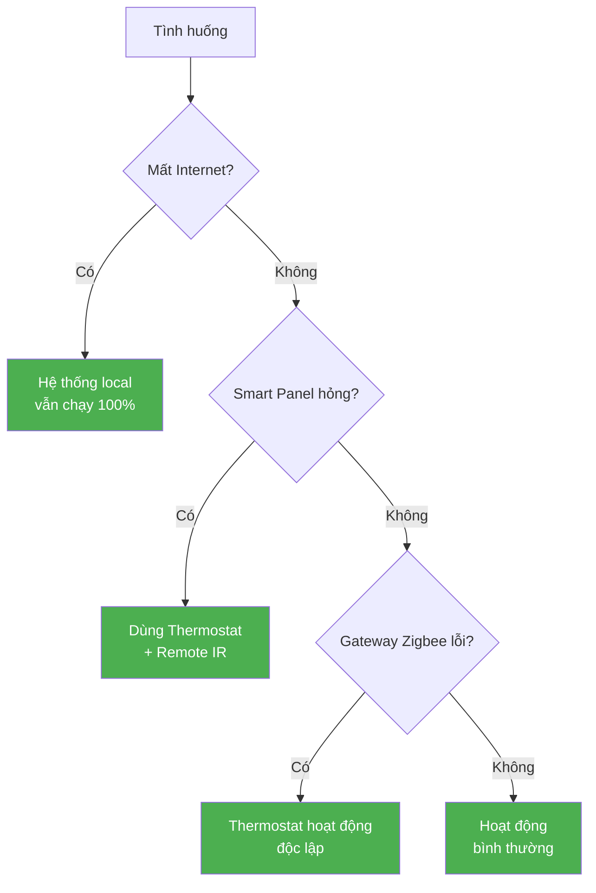

# Slide 3: Fail-safe

# Triệt tiêu nỗi sợ "Rủi ro vận hành"

---

## Nỗi sợ

> *"Nếu hệ thống lỗi, quán có phải đóng cửa không? Khách có bị nóng không? Đèn có tắt hết không?"*

**Hệ thống được thiết kế để không bao giờ làm gián đoạn vận hành.**

---

## Kiến trúc Local-First (Ưu tiên điều khiển tại chỗ)

### Điểm mạnh của Local-First

- **Smart Panel** hoạt động độc lập hoàn toàn tại quán
- **Không phụ thuộc internet** để điều khiển thiết bị
- Các kịch bản tự động (automation) chạy trên **Node-RED local**
- NanoMQ broker chạy **ngay tại chỗ**, không cần cloud
- Dù mất internet 1 tuần, hệ thống vẫn chạy bình thường

---

## Manual Override (Chế độ dự phòng vật lý)

### Các lớp dự phòng ( ví dụ với hệ thống điều hòa)

| Lớp | Cách thức | Tình huống |
|-----|-----------|------------|
| **Lớp 1: Tự động** | Smart Panel chạy automation | Hoạt động bình thường |
| **Lớp 2: Màn hình** | Nhấn trên màn hình cảm ứng LVGL | Khi cần điều chỉnh nhanh |
| **Lớp 3: Thermostat** | Bật/tắt trực tiếp thermostat trên tường | Khi Smart Panel lỗi |

---

## Các tình huống rủi ro & Giải pháp

| Tình huống | Ảnh hưởng | Giải pháp |
|-----------|-----------|-----------|
| **Mất internet** | Không có remote từ cloud | Local automation vẫn chạy |
| **Smart Panel lỗi** | Không có automation | Thermostat + Remote vẫn dùng được |
| **Gateway Zigbee lỗi** | Không tự động hóa | Thermostat bypass hoạt động |
| **Cảm biến hỏng** | Không tối ưu ánh sáng | Chuyển sang timer hoặc manual |
| **Mất điện** | Tất cả tắt | Bình thường như trước khi có hệ thống |

---

## Tổng kết

- ✅ **Không bao giờ** đóng cửa vì lỗi hệ thống
- ✅ **Không bao giờ** khách bị nóng/lạnh bất thường
- ✅ **Không bao giờ** mất điện đèn đột ngột
- ✅ Rủi ro vận hành = **gần như 0**

