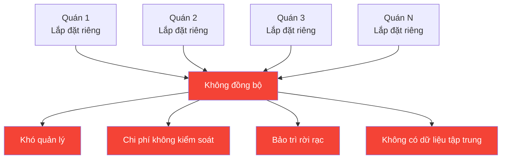
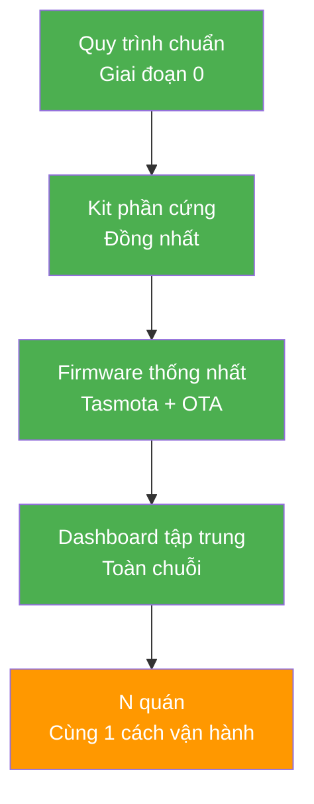
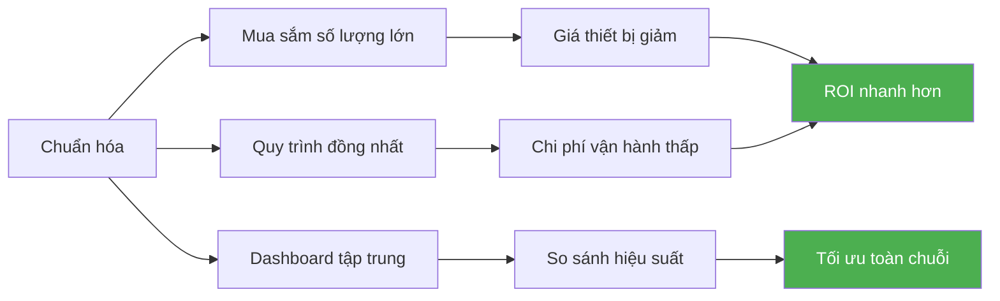

# Slide 4: Ban Giám đốc — Scalability

# Khả năng đóng gói và nhân rộng

## Thiết kế cho 1 quán = Thiết kế cho cả chuỗi 10-100 quán

---

## Vấn đề của giải pháp thủ công



### Hệ quả:

- Mỗi quán tự lắp đặt riêng lẻ → khó quản lý, chi phí không kiểm soát được
- Không có quy trình chuẩn → mỗi nơi một kiểu, khó bảo trì
- Không đồng bộ dữ liệu → không biết quán nào tiết kiệm, quán nào lãng phí

---

## Giải pháp: Kiến trúc chuẩn hóa



### 4 trụ cột chuẩn hóa

| Yếu tố | Cách thực hiện | Lợi ích |
|--------|---------------|---------|
| **Quy trình khảo sát chuẩn** | Checklist 1 site mẫu áp dụng cho mọi quán | Khảo sát nhanh, không bỏ sót |
| **Bộ thiết bị đồng bộ** | Cùng 1 loại Smart Panel, Gateway, cảm biến | Mua sắm số lượng lớn = giá tốt hơn |
| **Firmware thống nhất** | Tasmota + OTA update từ xa cho cả chuỗi | Cập nhật 1 lần, áp dụng mọi nơi |
| **Dashboard tập trung** | Theo dõi tất cả quán trên 1 hệ thống | So sánh, xếp hạng, tối ưu |

---

## Lộ trình triển khai chi tiết

```mermaid
gantt
    title Lộ trình triển khai chuỗi Smart Cafe
    dateFormat YYYY-MM
    section Giai đoạn chuẩn bị
    Giai đoạn 0: 1 site + Lab    :done, p0, 2024-01, 2w
    section Mở rộng
    Giai đoạn 1: 5 quán pilot    :active, p1, after p0, 1M
    Giai đoạn 2: 20 quán         :p2, after p1, 3M
    Giai đoạn 3: 50-100 quán     :p3, after p2, 6M
    
```

### Chi tiết từng giai đoạn

| Giai đoạn | Số quán | Thờigian | Mục tiêu |
|-----------|---------|----------|----------|
| **Giai đoạn 0** | 1 | 2 tuần | Chứng minh tính khả thi |
| **Giai đoạn 1** | 5 | 1 tháng | Kiểm tra vận hành thực tế |
| **Giai đoạn 2** | 20 | 3 tháng | Tối ưu quy trình, đào tạo |
| **Giai đoạn 3** | 50-100 | 6 tháng | Triển khai hàng loạt |

---

## So sánh: Thủ công vs Chuẩn hóa

| Tiêu chí | Lắp đặt thủ công | Giải pháp chuẩn hóa |
|----------|-----------------|-------------------|
| Thờigian khảo sát/quán | 2-3 ngày | 30 phút (theo checklist) |
| Thờigian lắp đặt/quán | 1-2 ngày | 2-3 giờ (kit sẵn sàng) |
| Chi phí/quán | Cao (mua lẻ) | Thấp (mua số lượng lớn) |
| Bảo trì | Mỗi quán khác nhau | Cùng 1 quy trình, cùng 1 firmware |
| Giám sát | Không có | Dashboard real-time toàn chuỗi |
| OTA update | Không thể | 1 lần cập nhật, toàn chuỗi nhận |

---

## Thông điệp thuyết phục

> *"Giải pháp này không phải làm manh mún từng quán. Nó được thiết kế để áp dụng cho cả chuỗi 10, 50 hay 100 cửa hàng với cùng một quy trình, cùng một bộ thiết bị."*

---

## Lợi ích khi nhân rộng



