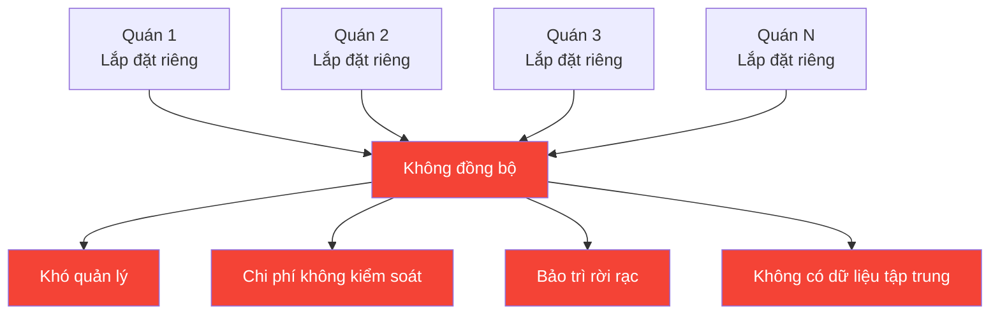
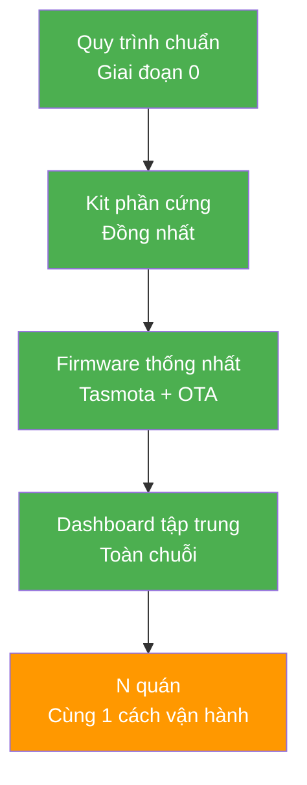

# Slide 4: Scalability

# Khả năng đóng gói và nhân rộng

## Thiết kế cho 1 quán = Thiết kế cho cả chuỗi 10-100 quán

---

## Vấn đề của giải pháp thủ công

### Hệ quả:

- Mỗi quán tự lắp đặt riêng lẻ → khó quản lý, chi phí không kiểm soát được
- Không có quy trình chuẩn → mỗi nơi một kiểu, khó bảo trì
- Không đồng bộ dữ liệu → không biết quán nào tiết kiệm, quán nào lãng phí

---

## Giải pháp: Kiến trúc chuẩn hóa

### 4 trụ cột chuẩn hóa

| Yếu tố | Cách thực hiện | Lợi ích |
|--------|---------------|---------|
| **Quy trình khảo sát chuẩn** | Checklist 1 site mẫu áp dụng cho mọi quán | Khảo sát nhanh, không bỏ sót |
| **Bộ thiết bị đồng bộ** | Cùng 1 loại Smart Panel, Gateway, cảm biến | Mua sắm số lượng lớn = giá tốt hơn |
| **Firmware thống nhất** | Tasmota + OTA update từ xa cho cả chuỗi | Cập nhật 1 lần, áp dụng mọi nơi |
| **Dashboard tập trung** | Theo dõi tất cả quán trên 1 hệ thống | So sánh, xếp hạng, tối ưu |

---