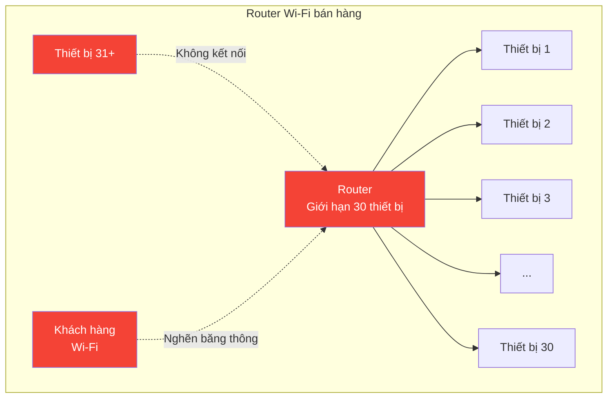
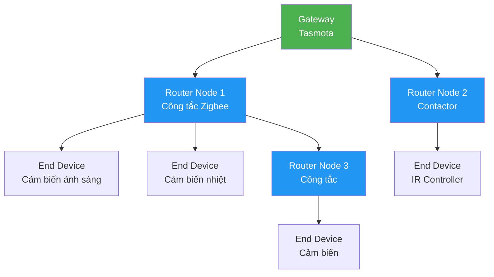

# Slide 5: Team Kỹ thuật — Zigbee vs Wi-Fi

# Khẳng định tính đúng đắn của giải pháp Công nghệ

## Tại sao chọn Zigbee và Tasmota thay vì Wi-Fi dân dụng?

---

## Vấn đề của Wi-Fi dân dụng trong F&B



### Hạn chế cụ thể

- **Giới hạn kết nối:** Router Wi-Fi bán hàng chỉ chịu được 20-30 thiết bị
- **Nghẽn băng thông:** Mỗi thiết bị chiếm 1 IP, làm chậm mạng cho khách hàng
- **Bảo mật kém:** Thiết bị Wi-Fi dễ bị tấn công, dễ bị ngắt kết nối
- **Phụ thuộc router:** Nếu router lỗi = toàn bộ hệ thống tự động sập
- **Tiêu thụ điện cao:** Cần nguồn 220V liên tục

---

## Ưu điểm vượt trội của Zigbee + Tasmota

### Bảng so sánh chi tiết

| Tiêu chí | Zigbee + Tasmota | Wi-Fi dân dụng |
|----------|-----------------|----------------|
| **Số thiết bị/Gateway** | 50-100+ | 20-30 |
| **Băng thông mạng khách** | Không chiếm IP | Chiếm IP, nghẽn mạng |
| **Mesh network** | ✅ Tự động tạo mạng lưới | ❌ Không có |
| **Bảo mật** | ✅ Mã hóa AES-128 | ❌ Dễ bị tấn công |
| **Tiêu thụ điện** | ✅ Rất thấp (pin solar được) | ❌ Cần nguồn 220V |
| **Độ ổn định** | ✅ Hoạt động độc lập Wi-Fi | ❌ Phụ thuộc router |
| **Khoảng cách** | ✅ 10-20m, relay qua mesh | ❌ 10-50m, không relay |
| **Chi phí thiết bị** | ✅ Thấp (chip đơn giản) | ❌ Cao (TCP/IP stack) |

---

## Mesh Network: Bí mật của Zigbee



### Nguyên lý hoạt động

- **Router Node:** Các thiết bị có nguồn điện (công tắc, contactor) tự động **chuyển tiếp tín hiệu**
- **End Device:** Các thiết bị pin (cảm biến) gửi dữ liệu đến node gần nhất
- **Tự phục hồi:** Nếu 1 node lỗi, dữ liệu tự động đi đường khác
- **Mở rộng:** Thêm thiết bị = mở rộng mạng, không cần thêm gateway

---

## Sơ đồ kiến trúc Zigbee trong quán

```mermaid
graph TB
    subgraph "Quán Cafe"
        A[Gateway Tasmota<br/>Ewelink Zigbee Pro] --> B[Công tắc đèn chính<br/>Router]
        A --> C[Contactor điều hòa<br/>Router]
        A --> D[Công tắc đèn biển<br/>Router]
        
        B --> E[Cảm biến ánh sáng<br/>khu vực A<br/>End Device]
        B --> F[Cảm biến ánh sáng<br/>khu vực B<br/>End Device]
        C --> G[Cảm biến nhiệt<br/>End Device]
        D --> H[IR Controller<br/>Điều hòa<br/>End Device]
    end
    
    A -. Zigbee 3.0 .-> I[Smart Panel<br/>MQTT]
    
    style A fill:#4CAF50,color:#fff
    style B fill:#2196F3,color:#fff
    style C fill:#2196F3,color:#fff
    style D fill:#2196F3,color:#fff
```

---

## Thiết bị cụ thể trong dự án

| Vai trò | Thiết bị | Chức năng |
|---------|----------|-----------|
| **Gateway** | Hub Ewelink Zigbee Pro (flash Tasmota) | Trung tâm điều phối Zigbee ↔ MQTT |
| **Cảm biến** | Cảm biến ánh sáng (pin solar) | Đo ánh sáng tự nhiên, tự động điều chỉnh đèn |
| **Công tắc** | Công tắc Zigbee | Bật/tắt đèn, có chức năng router |
| **Contactor** | Contactor Zigbee | Điều khiển điều hòa công suất lớn |
| **IR** | Bộ điều khiển hồng ngoại Zigbee | Điều khiển điều hòa cũ không có cổng thông minh |

---

## Thông điệp thuyết phục

> *"Zigbee tự tạo mạng mesh nội bộ, không chiếm IP của router Wi-Fi bán hàng, cực kỳ bảo mật và ổn định. Đây là công nghệ chuẩn công nghiệp, không phải đồ chơi gia đình."*

---

## Cam kết kỹ thuật

- ✅ Hỗ trợ **50-100 thiết bị** trên 1 gateway
- ✅ **Không ảnh hưởng** Wi-Fi khách hàng
- ✅ **Tự phục hồi** khi 1 node lỗi
- ✅ **Bảo mật AES-128** theo chuẩn Zigbee 3.0
- ✅ Cảm biến **pin solar** = không cần đi dây điện

