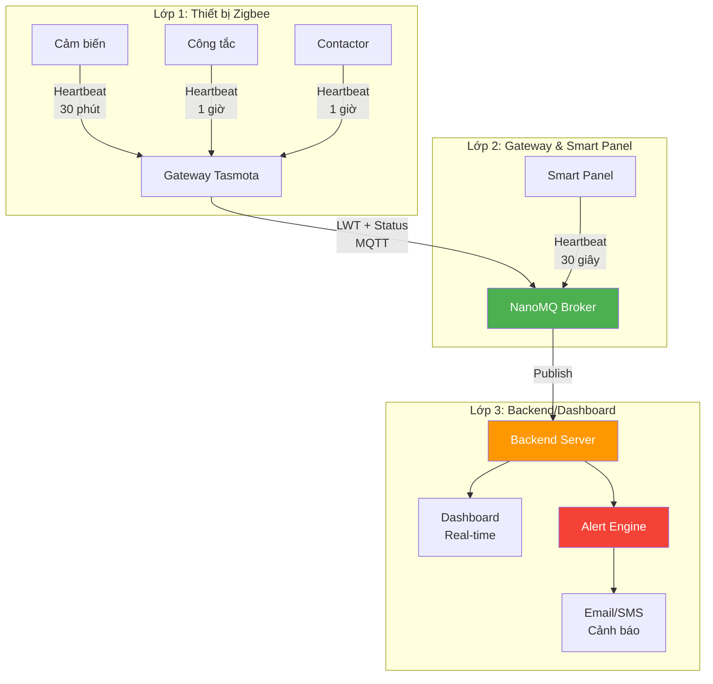
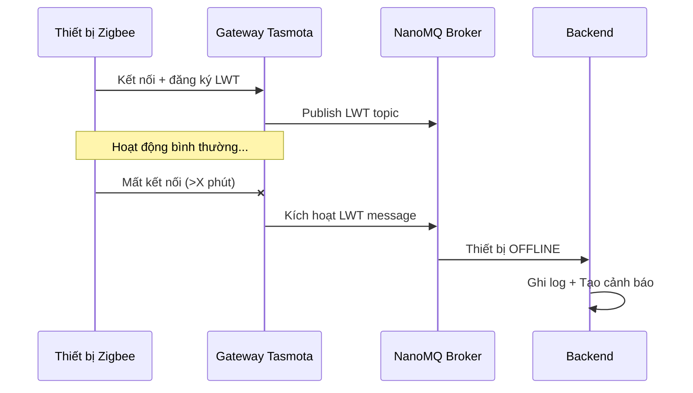
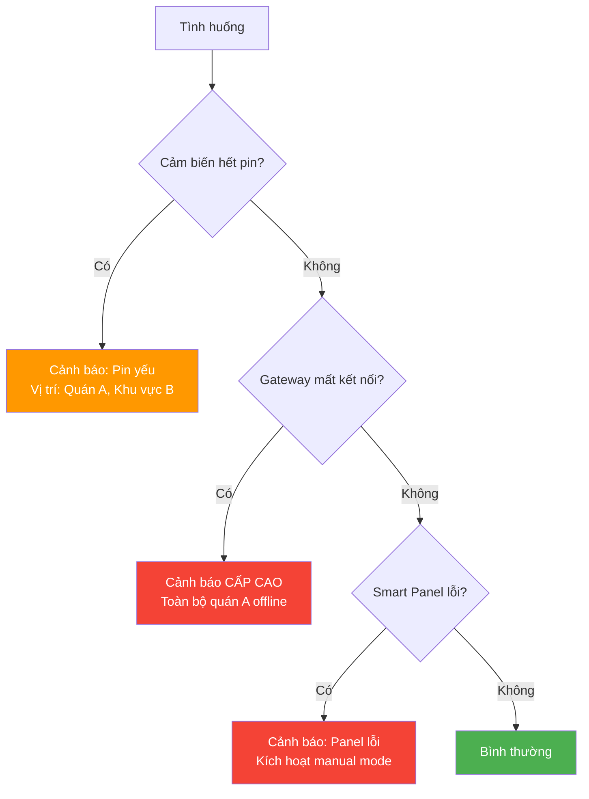
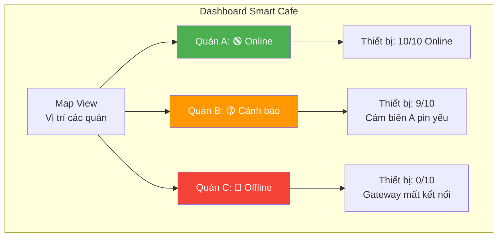

# Slide 6: Watchdog & Maintenance

# Khả năng giám sát "Sức khỏe" hệ thống

## Không để kỹ thuật phải "đoán mò"

---

## Nỗi sợ của Team Kỹ thuật

> *"Giải pháp vẽ ra thì hay, nhưng thực tế chạy chập chờn, suốt ngày phải đi sửa."*

**Cam kết: Hệ thống tự chẩn đoán, báo lỗi chính xác, giảm 80% thờigian xử lý sự cố.**

---

## Cơ chế giám sát 3 lớp



---

## 1. LWT (Last Will and Testament)

### Nguyên lý



- Thiết bị Zigbee gửi tín hiệu "còn sống" định kỳ
- Nếu mất tín hiệu quá ngưỡng (configurable) → hệ thống tự động đánh dấu **"Offline"**
- **Không cần kỹ thuật viên kiểm tra từng thiết bị**

---

## 2. Heartbeat từ Smart Panel

```mermaid
graph LR
    A[Smart Panel<br/>Luckfox RV1106] -->|{"status":"online",<br/>"cpu":45%,<br/>"temp":55°C,<br/>"uptime":"15d"}| B[NanoMQ]
    B --> C[Backend]
    C --> D{Kiểm tra}
    D -->|Bình thường| E[Xanh]
    D -->|CPU cao| F[Vàng - Cảnh báo]
    D -->|Mất heartbeat| G[Đỏ - Offline]
    
    style E fill:#4CAF50,color:#fff
    style F fill:#FF9800,color:#fff
    style G fill:#f44336,color:#fff
```

- Smart Panel gửi heartbeat đầy đủ thông tin hệ thống
- Tần suất: **Mỗi 30-60 giây**
- Nếu mất heartbeat → cảnh báo ngay lập tức

---

## 3. Cảnh báo tự động theo tình huống



### Bảng cảnh báo chi tiết

| Tình huống | Mức độ | Cảnh báo | Hành động tự động |
|-----------|--------|----------|-------------------|
| Cảm biến pin yếu | Thấp | Thông báo vị trí | Lập lịch thay pin |
| Cảm biến hết pin | Trung bình | Cảnh báo + đề xuất | Chuyển sang timer |
| Công tắc mất nguồn | Trung bình | Cảnh báo vị trí | Kiểm tra điện |
| Gateway mất kết nối | Cao | Cảnh báo cấp độ cao | Kích hoạt backup |
| Smart Panel không phản hồi | Cao | Cảnh báo + manual | Bypass automation |
| Nhiệt độ panel cao | Trung bình | Cảnh báo | Tăng tốc quạt |

---

## Dashboard giám sát tập trung



### Tính năng Dashboard

- **Real-time status:** Hiển thị trạng thái tất cả thiết bị
- **Màu sắc phân biệt:**
  - 🟢 Xanh: Online, hoạt động tốt
  - 🟡 Vàng: Cảnh báo (cần chú ý)
  - 🔴 Đỏ: Offline/Lỗi (cần xử lý ngay)
- **Lịch sử sự kiện:** Biết chính xác thời điểm thiết bị lỗi
- **Báo cáo định kỳ:** Tự động gửi báo cáo tuần/tháng

---
## Lợi ích cho Team Kỹ thuật

- ✅ **Giảm 80% thờigian xử lý sự cố** nhờ biết chính xác vị trí lỗi
- ✅ **Proactive maintenance** thay vì reactive (sửa khi hỏng)
- ✅ **Giảm tải cho team kỹ thuật**, không cần kiểm tra định kỳ thủ công
- ✅ **Remote diagnostics:** Chẩn đoán từ xa trước khi đến quán

