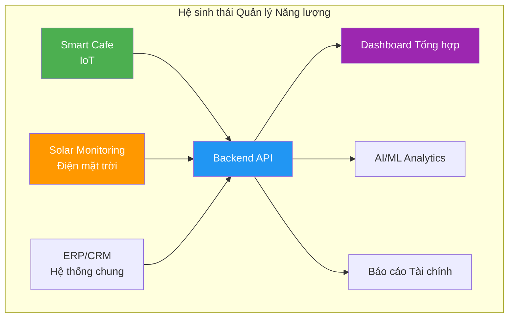
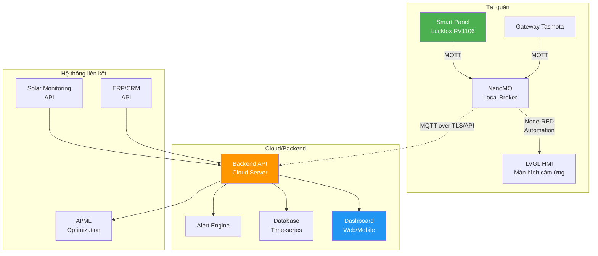
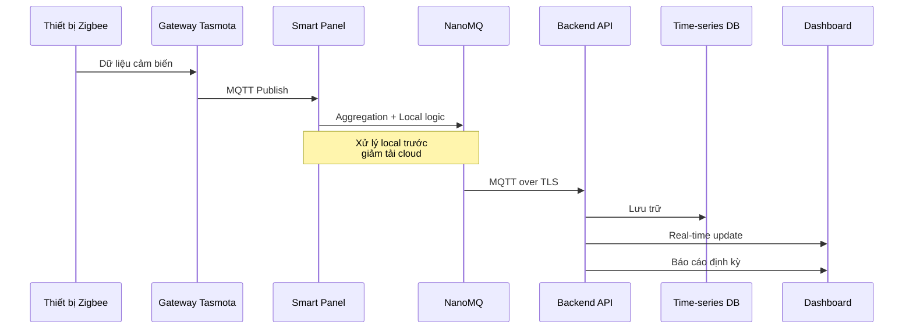
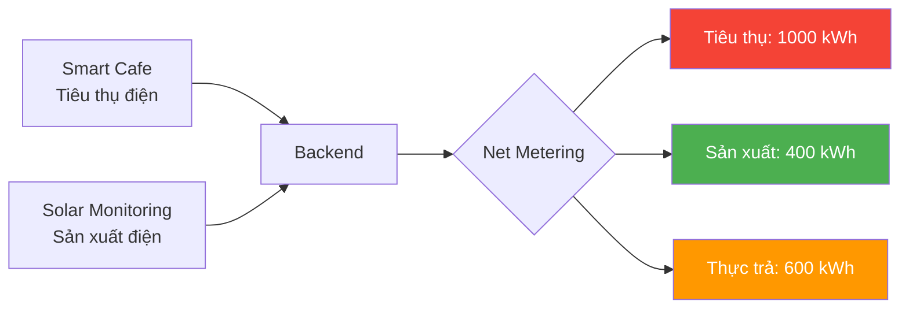
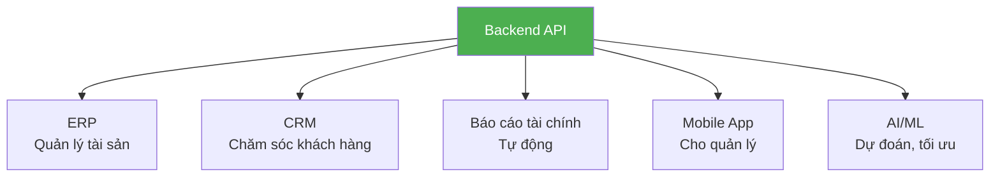
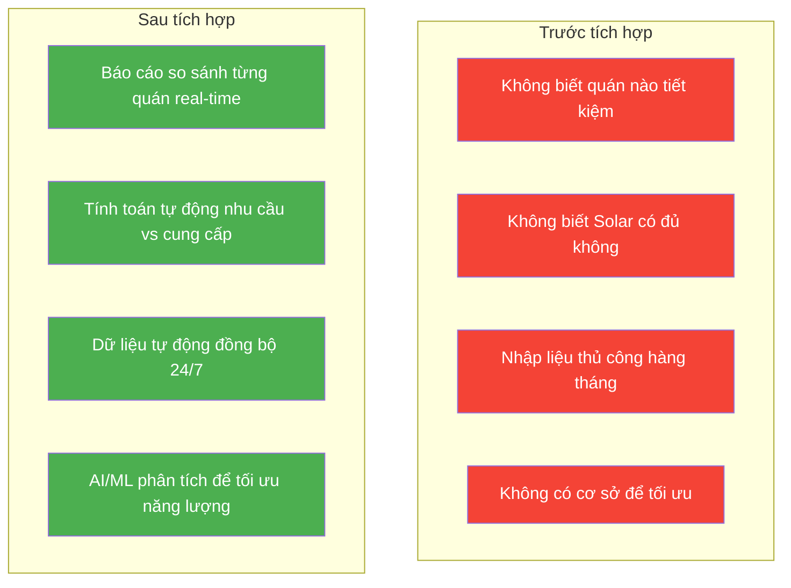

# Slide 7: Team Kỹ thuật — Integration

# Tích hợp sâu vào hệ thống chung

## Không đứng độc lập — Là mảnh ghép hoàn hảo

---

## Tầm nhìn tích hợp

Giải pháp Smart Cafe không phải một đảo thông tin riêng lẻ. Nó là **mảnh ghép** trong bức tranh quản lý năng lượng tổng thể của công ty.

---

## Kiến trúc tích hợp tổng thể

---

## Luồng dữ liệu từ quán về backend

---

## 3 điểm tích hợp chính

### 1. MQTT → Backend trung tâm

| Dữ liệu | Tần suất | Mục đích |
|---------|----------|----------|
| Trạng thái thiết bị | Real-time | Giám sát |
| Dữ liệu cảm biến | 5-15 phút | Phân tích, tối ưu |
| Điện năng tiêu thụ | 15-30 phút | Tính toán chi phí |
| Sự kiện (bật/tắt) | Real-time | Audit log |

- Backend subscribe và lưu trữ, phân tích
- **Real-time dashboard** cho toàn chuỗi

### 2. Đối chiếu với điện mặt trời (Solar)

- Hệ thống Smart Cafe biết **mỗi quán tiêu thụ bao nhiêu điện**
- Hệ thống Solar biết **mỗi quán sản xuất bao nhiêu điện**
- **Tính toán net-metering:** Tiêu thụ - Sản xuất = Chi phí thực tế
- Tối ưu hóa: Khi nào nên dùng điện solar, khi nào nên tiết kiệm

### 3. API mở rộng

- Cung cấp RESTful API cho các hệ thống khác
- Đồng bộ dữ liệu tự động, không cần nhập liệu thủ công
- Mở rộng: AI/ML phân tích pattern tiêu thụ, dự đoán hỏng hóc

---

## Giá trị trước & sau tích hợp

---

## Thông điệp thuyết phục

> *"Giải pháp này không đứng độc lập. Nó là một mảnh ghép hoàn hảo trong bức tranh lớn của công ty — kết nối từ màn hình cảm ứng tại quán, qua MQTT/API về hệ thống quản lý chung, và đối chiếu với sản lượng điện mặt trời."*

---

## Lợi ích tích hợp

- ✅ **Dữ liệu tập trung:** Một nơi xem toàn bộ hệ thống
- ✅ **Tự động hóa:** Không nhập liệu thủ công
- ✅ **Tối ưu toàn diện:** Kết hợp tiêu thụ + sản xuất điện
- ✅ **Mở rộng:** Dễ dàng tích hợp AI/ML, ERP, CRM trong tương lai

