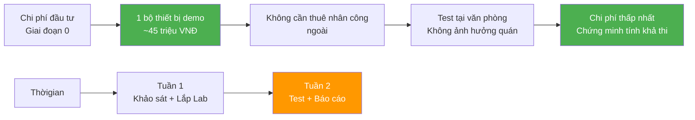
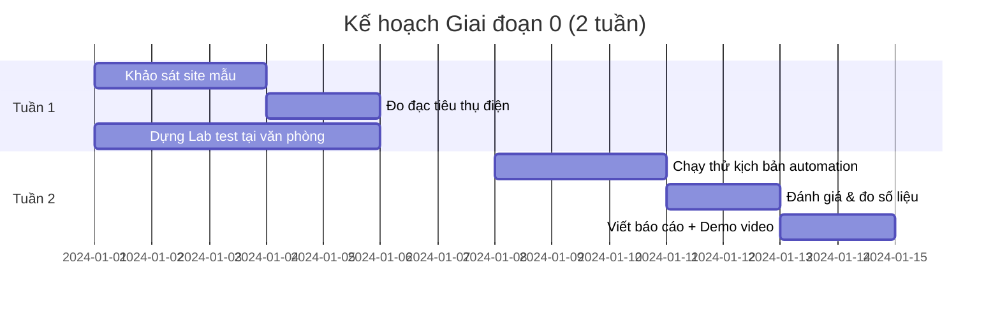
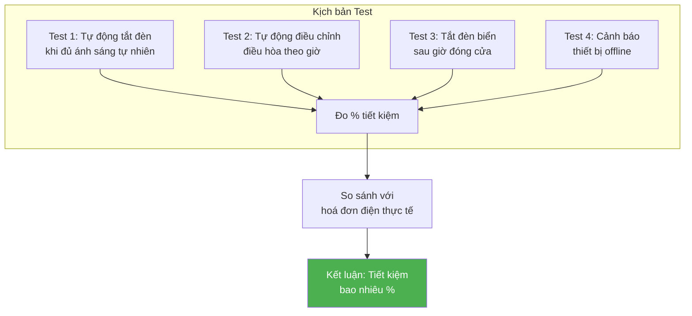
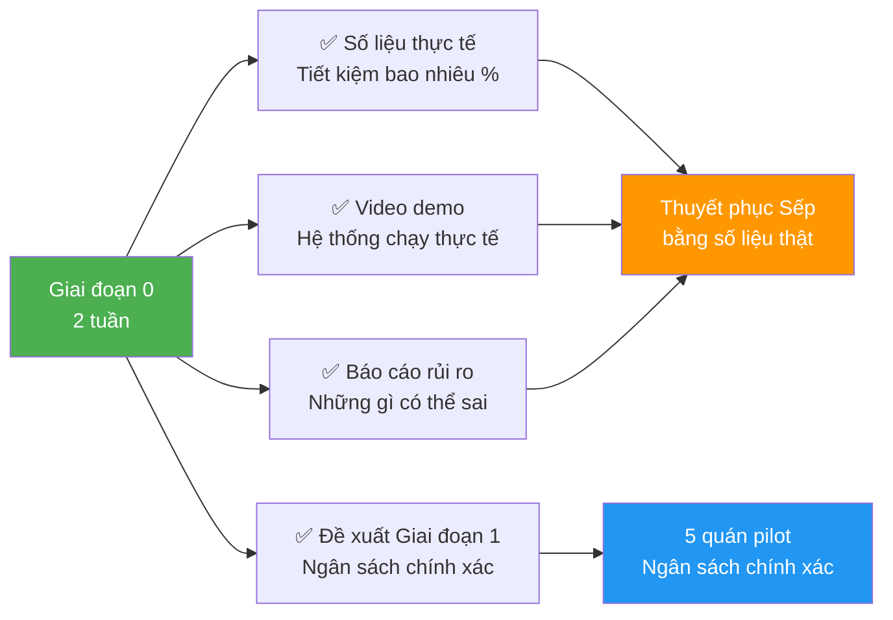
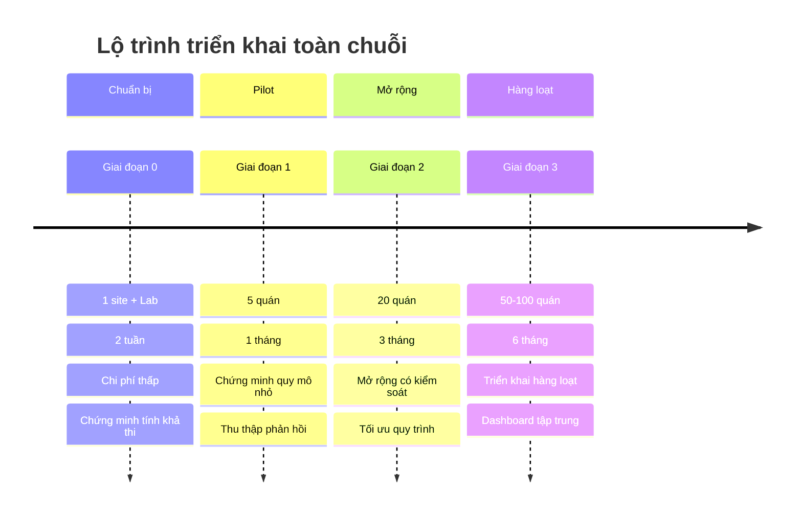

# Slide 8: Bước tiếp theo — Giai đoạn 0

# Khảo sát 1 site mẫu + Lab Test

## Tiếp cận khoa học, giảm thiểu rủi ro, chi phí cực thấp

---

## Vấn đề của nhiều dự án

> *"Đề xuất ngân sách quá lớn ngay từ đầu → Sếp bác bỏ ngay lập tức."*

---

## Chiến lược: Giai đoạn 0 (Proof of Concept)

### Không yêu cầu duyệt ngân sách cho cả chuỗi.

Chỉ cần duyệt: **"Cho phép team triển khai khảo sát 1 site mẫu và dựng mô hình Lab trong 2 tuần để chứng minh tính khả thi."**

---

## Chi phí & Thờigian Giai đoạn 0

---

## Nội dung chi tiết Giai đoạn 0

| Hạng mục | Chi tiết | Thờigian | Output |
|----------|----------|----------|--------|
| **Khảo sát 1 site mẫu** | Đo đạc thực tế mức tiêu thụ điện, vị trí lắp đặt, điều kiện môi trường | 2-3 ngày | Bản đồ vị trí + Số liệu thực tế |
| **Dựng Lab Test** | Lắp đặt đầy đủ 1 bộ Smart Panel + Gateway + thiết bị Zigbee tại văn phòng | 3-5 ngày | Môi trường test hoạt động |
| **Chạy thử kịch bản** | Test automation: Điều hòa tự động, đèn tự động, cảnh báo | 3-5 ngày | Log hoạt động + Video demo |
| **Đánh giá & báo cáo** | So sánh số liệu trước/sau, đề xuất tinh chỉnh | 2-3 ngày | Báo cáo chi tiết |
| **Tổng** | | **~2 tuần** | **Bộ chứng minh tính khả thi** |

---

## Các kịch bản test trong Lab

### Chi tiết từng kịch bản

| Kịch bản | Mô tả | Kết quả mong đợi |
|----------|-------|-----------------|
| **Tự động điều chỉnh đèn** | Cảm biến ánh sáng phát hiện đủ sáng → tắt đèn nhân tạo | Tiết kiệm 20-30% điện chiếu sáng |
| **Tự động điều hòa** | Theo giờ cao điểm/thấp điểm, cảm biến nhiệt độ | Tiết kiệm 25-35% điện điều hòa |
| **Tự động tắt đèn biển** | Timer sau giờ đóng cửa | Tiết kiệm 100% điện lãng phí đêm |
| **Cảnh báo thiết bị** | Rút pin cảm biến, kiểm tra cảnh báo | Phát hiện lỗi trong < 5 phút |

---

## Output của Giai đoạn 0

### Deliverables cụ thể

1. **Số liệu thực tế:** Bảng so sánh tiêu thụ điện trước/sau khi áp dụng
2. **Video demo:** 5-10 phút ghi lại hệ thống hoạt động tự động
3. **Báo cáo rủi ro:** Danh sách rủi ro + kế hoạch mitigration
4. **Đề xuất Giai đoạn 1:** Ngân sách chính xác cho 5 quán pilot với timeline

---

## So sánh: Có vs Không có Giai đoạn 0

| | Không có Giai đoạn 0 | Có Giai đoạn 0 |
|---|---------------------|---------------|
| **Ngân sách đề xuất** | Ước tính, không chắc chắn | Dựa trên số liệu thực tế |
| **Rủi ro** | Cao (chưa test) | Thấp (đã chứng minh) |
| **Thuyết phục Sếp** | Khó (lý thuyết suông) | Dễ (có số liệu, video demo) |
| **Timeline triển khai** | Có thể delay vì phát sinh | Chính xác vì đã test |
| **Tỷ lệ phê duyệt** | Thấp | **Cao** |

---

## Thông điệp thuyết phục

> *"Sếp sẽ cực kỳ yên tâm vì thấy bạn tiếp cận dự án rất khoa học, cẩn trọng và kiểm soát rủi ro tốt. Giai đoạn 0 là vũ khí giúp bạn giảm thiểu rào cản phòng thủ của sếp."*

---

## Lộ trình đề xuất đầy đủ

| Giai đoạn | Số quán | Thờigian | Chi phí | Mục tiêu |
|-----------|---------|----------|---------|----------|
| **Giai đoạn 0** | 1 | 2 tuần | ~45 triệu | Chứng minh tính khả thi |
| **Giai đoạn 1** | 5 | 1 tháng | ~225 triệu | Kiểm tra vận hành thực tế |
| **Giai đoạn 2** | 20 | 3 tháng | ~900 triệu | Tối ưu quy trình, đào tạo |
| **Giai đoạn 3** | 50-100 | 6 tháng | ~2.25-4.5 tỷ | Triển khai hàng loạt |

---

## Lợi ích của cách tiếp cận từng bước

- ✅ **Giảm rủi ro tài chính:** Không đầu tư lớn ngay từ đầu
- ✅ **Có dữ liệu thực:** Thuyết phục bằng số liệu, không phải lý thuyết
- ✅ **Tinh chỉnh giải pháp:** Phát hiện vấn đề sớm, sửa trước khi nhân rộng
- ✅ **Xây dựng niềm tin:** Sếp yên tâm vì thấy quy trình khoa học

