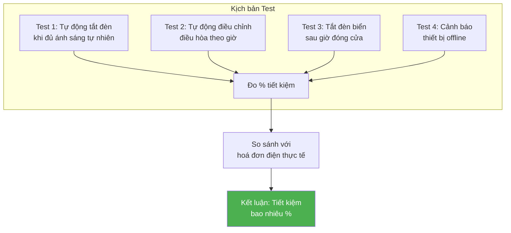
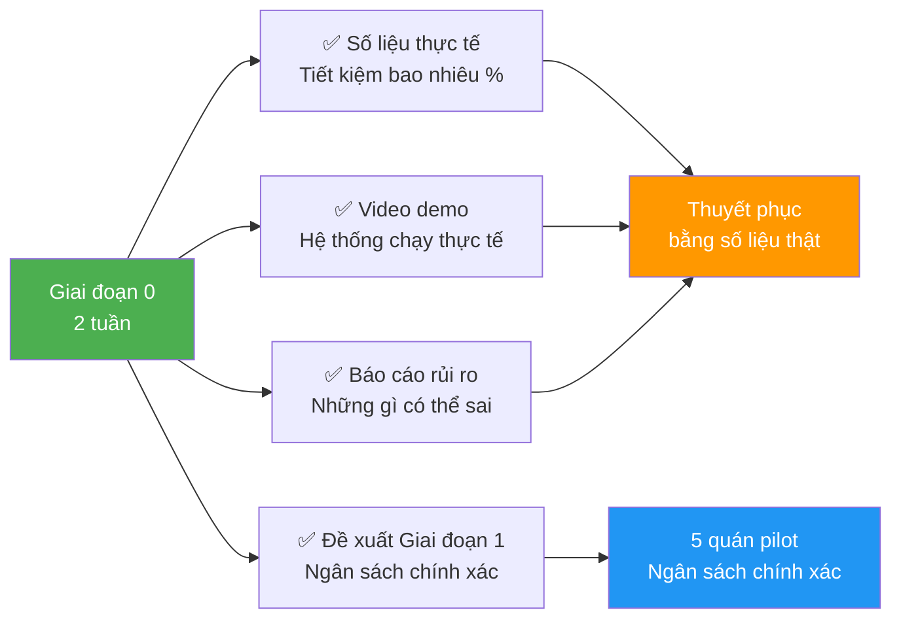

# Slide 8: Bước tiếp theo — Giai đoạn thử nghiệm

# Khảo sát 1 site mẫu + Lab Test

## Nội dung chi tiết Giai đoạn thử nghiệm

| Hạng mục | Chi tiết | Thờigian | Output |
|----------|----------|----------|--------|
| **Khảo sát 1 site mẫu** | Đo đạc thực tế mức tiêu thụ điện, vị trí lắp đặt, điều kiện môi trường | 2-3 ngày | Bản đồ vị trí + Số liệu thực tế |
| **Dựng Lab Test** | Lắp đặt đầy đủ 1 bộ Smart Panel + Gateway + thiết bị Zigbee tại văn phòng | 3-5 ngày | Môi trường test hoạt động |
| **Chạy thử kịch bản** | Test automation: Điều hòa tự động, đèn tự động, cảnh báo | 3-5 ngày | Log hoạt động + Video demo |
| **Đánh giá & báo cáo** | So sánh số liệu trước/sau, đề xuất tinh chỉnh | 2-3 ngày | Báo cáo chi tiết |
| **Tổng** | | **~2 tuần** | **Bộ chứng minh tính khả thi** |

---

## Các kịch bản test trong Lab

### Chi tiết từng kịch bản

| Kịch bản | Mô tả | Kết quả mong đợi |
|----------|-------|-----------------|
| **Tự động điều chỉnh đèn** | Cảm biến ánh sáng phát hiện đủ sáng → tắt đèn nhân tạo | Tiết kiệm 20-30% điện chiếu sáng |
| **Tự động điều hòa** | Theo giờ cao điểm/thấp điểm, cảm biến nhiệt độ | Tiết kiệm 25-35% điện điều hòa |
| **Tự động tắt đèn biển** | Timer sau giờ đóng cửa | Tiết kiệm 100% điện lãng phí đêm |
| **Cảnh báo thiết bị** | Rút pin cảm biến, kiểm tra cảnh báo | Phát hiện lỗi trong < 5 phút |

---

## Output của Giai đoạn 0

### Deliverables cụ thể

1. **Số liệu thực tế:** Bảng so sánh tiêu thụ điện trước/sau khi áp dụng
2. **Video demo:** 5-10 phút ghi lại hệ thống hoạt động tự động
3. **Báo cáo rủi ro:** Danh sách rủi ro + kế hoạch mitigration
4. **Đề xuất Giai đoạn 1:** Ngân sách chính xác cho 5 quán pilot với timeline

---

## Lợi ích của cách tiếp cận từng bước

- ✅ **Giảm rủi ro tài chính:** Không đầu tư lớn ngay từ đầu
- ✅ **Có dữ liệu thực:** Thuyết phục bằng số liệu, không phải lý thuyết
- ✅ **Tinh chỉnh giải pháp:** Phát hiện vấn đề sớm, sửa trước khi nhân rộng

