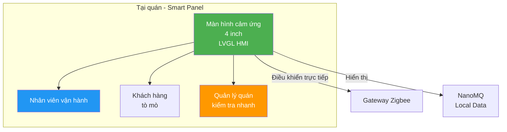
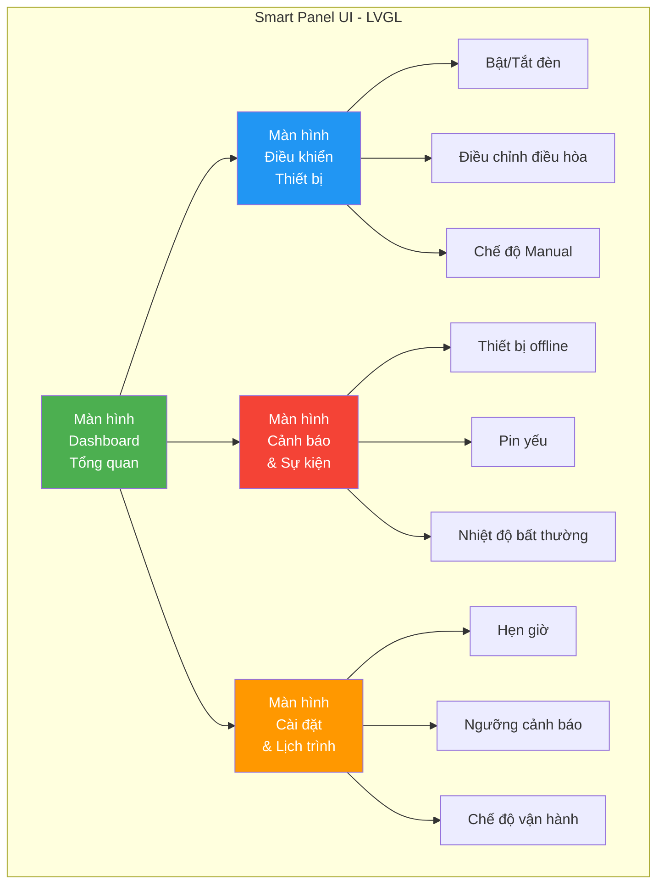

# Slide 9: Giao diện Smart Panel — HMI Tại Quán

# Màn hình cảm ứng LVGL trên Smart Panel

## Điều khiển trực quan, không cần đào tạo

---

## Vị trí và vai trò



- **Vị trí:** Gắn tường tại quầy thu ngân hoặc khu vực vận hành
- **Ngườidùng:** Nhân viên quán (không cần kỹ thuật), Quản lý quán
- **Mục tiêu:** Điều khiển nhanh, giám sát trạng thái, không cần đào tạo phức tạp

---

## Kiến trúc giao diện LVGL



### Tại sao LVGL?

| Tiêu chí | LVGL | Web UI trên panel |
|----------|------|-------------------|
| **Hiệu suất** | ✅ C++ native, phản hồi < 16ms | ❌ Cần browser, nặng hơn |
| **Tài nguyên** | ✅ 256MB DDR3L đủ dùng | ❌ Cần RAM lớn hơn |
| **Khởi động** | ✅ < 3 giây | ❌ 10-30 giây |
| **Offline** | ✅ Chạy hoàn toàn local | ⚠️ Có thể cần load resource |
| **Tùy biến** | ✅ Vẽ pixel-level, mượt mà | ⚠️ Phụ thuộc CSS framework |

---

## Màn hình 1: Dashboard Tổng quan

### Wireframe mô tả

```
┌─────────────────────────────────────┐
│  🏠 Smart Cafe - Quán A    🕐 14:30  │  ← Header: Tên quán + Thờigian
├─────────────────────────────────────┤
│  ┌──────────┐  ┌──────────┐         │
│  │  💡 Đèn   │  │  ❄️ ĐH    │         │  ← Status Cards
│  │  ON 12/15 │  │  ON 22°C  │         │     (Số thiết bị hoạt động)
│  │  Tiết kiệm│  │  Target   │         │
│  │  25%      │  │  24°C     │         │
│  └──────────┘  └──────────┘         │
│  ┌──────────┐  ┌──────────┐         │
│  │  ⚡ Điện  │  │  🌞 Ánh   │         │
│  │  45.2 kWh│  │  Sáng 850 │         │
│  │  Hôm nay │  │  lux      │         │
│  └──────────┘  └──────────┘         │
├─────────────────────────────────────┤
│  🟢 Online: 14  🟡 Cảnh báo: 1      │  ← Footer: Tóm tắt trạng thái
│  [⚙️ Điều khiển] [🔔 Cảnh báo]      │  ← Navigation buttons
└─────────────────────────────────────┘
```

### Thông tin hiển thị

| Widget | Dữ liệu | Cập nhật |
|--------|---------|----------|
| **Status Cards** | Số thiết bị ON/OFF, nhiệt độ mục tiêu | Real-time |
| **Tiết kiệm điện** | % tiết kiệm so với ngày/tháng trước | 15 phút |
| **Công suất** | kWh tiêu thụ hôm nay | 5 phút |
| **Cảm biến** | Giá trị ánh sáng, nhiệt độ | Real-time |
| **Footer** | Tổng số thiết bị online/offline/cảnh báo | Real-time |

---

## Màn hình 2: Điều khiển Thiết bị

### Wireframe mô tả

```
┌─────────────────────────────────────┐
│  ← Quay lại     Điều khiển Thiết bị │
├─────────────────────────────────────┤
│  💡 HỆ THỐNG ĐÈN                    │
│  ├─ Đèn chính khu A    [🟢 ON]  [⚪]│  ← Toggle switch
│  ├─ Đèn chính khu B    [⚪ OFF] [⚪]│
│  ├─ Đèn biển quảng cáo [🟢 ON]  [⚪]│
│  ├─ Đèn WC             [🟢 ON]  [⚪]│
│                                     │
│  ❄️ HỆ THỐNG ĐIỀU HÒA               │
│  ├─ ĐH Khu vực khách   [🟢 ON]      │
│  │   Nhiệt độ: [22°C]  [+] [-]      │  ← Stepper control
│  │   Chế độ: [Tự động ▼]            │  ← Dropdown
│  ├─ ĐH Khu bếp         [⚪ OFF]      │
│                                     │
│  [💾 Lưu cài đặt] [↩️ Khôi phục]    │
└─────────────────────────────────────┘
```

### Tính năng điều khiển

| Thiết bị | Điều khiển | Phản hồi |
|----------|-----------|----------|
| **Đèn** | Toggle ON/OFF, điều chỉnh độ sáng (slider) | Đèn thực tế bật/tắt trong < 1 giây |
| **Điều hòa** | Bật/tắt, nhiệt độ mục tiêu (16-30°C), chế độ (auto/cool/fan) | IR gửi lệnh ngay lập tức |
| **Contactor** | Toggle ON/OFF với xác nhận (tránh nhấn nhầm) | Relay tác động + phản hồi trạng thái |
| **Chế độ Manual** | Override toàn bộ automation, chuyển sang điều khiển tay | Hiển thị cảnh báo màu đỏ trên header |

---

## Màn hình 3: Cảnh báo & Sự kiện

### Wireframe mô tả

```
┌─────────────────────────────────────┐
│  ← Quay lại     Cảnh báo & Sự kiện  │
├─────────────────────────────────────┤
│  🔴 CẢNH BÁO ĐANG HOẠT ĐỘNG         │
│  ┌─────────────────────────────────┐│
│  │ ⚠️ Cảm biến ánh sáng khu B      ││
│  │    Pin yếu (15%) - Cần thay pin ││
│  │    14:25 - [✅ Đã xem]          ││
│  └─────────────────────────────────┘│
│                                     │
│  📋 LỊCH SỬ SỰ KIỆN (Hôm nay)       │
│  ┌─────────────────────────────────┐│
│  │ 🟢 08:00 - Hệ thống tự động bật ││
│  │ 🟢 10:30 - Đèn biển tắt (đủ sáng)││
│  │ 🟡 12:00 - ĐH tăng lên 24°C     ││
│  │ 🟢 18:00 - Đèn biển bật         ││
│  └─────────────────────────────────┘│
│                                     │
│  [🔔 Tắt cảnh báo] [📊 Xuất log]    │
└─────────────────────────────────────┘
```

### Phân loại cảnh báo trên UI

| Mức độ | Màu | Âm thanh | Hành động |
|--------|-----|----------|-----------|
| **🔴 Cao** | Đỏ + nhấp nháy | Có | Pop-up + Bắt buộc xác nhận |
| **🟡 Trung bình** | Vàng | Không | Badge trên icon chuông |
| **🟢 Thông tin** | Xanh | Không | Ghi vào log, không hiển thị popup |

---

## Màn hình 4: Cài đặt & Lịch trình

### Wireframe mô tả

```
┌─────────────────────────────────────┐
│  ← Quay lại     Cài đặt & Lịch trình│
├─────────────────────────────────────┤
│  📅 LỊCH TRÌNH TỰ ĐỘNG              │
│  ├─ 06:00 - Bật đèn chính (50%)     │
│  ├─ 07:00 - Bật điều hòa 24°C       │
│  ├─ 10:00 - Tắt đèn biển (nếu đủ    │
│  │         ánh sáng > 500 lux)      │
│  ├─ 18:00 - Bật đèn biển 100%       │
│  ├─ 22:00 - Tắt điều hòa khu bếp    │
│  └─ 23:00 - Tắt toàn bộ (trừ WC)    │
│                                     │
│  [➕ Thêm lịch] [🗑️ Xóa] [✏️ Sửa]  │
│                                     │
│  ⚙️ CÀI ĐẶT CHUNG                   │
│  ├─ Chế độ mặc định: [Tự động ▼]   │
│  ├─ Ngưỡng ánh sáng: [500] lux      │
│  ├─ Ngưỡng nhiệt độ: [26] °C        │
│  └─ Ngôn ngữ: [Tiếng Việt ▼]        │
└─────────────────────────────────────┘
```

---

## Luồng điều hướng (Navigation Flow)

```mermaid
graph TB
    A[Màn hình<br/>Khóa/Standby] -->|Chạm màn hình| B[Dashboard<br/>Tổng quan]
    B -->|Nhấn "Điều khiển"| C[Điều khiển<br/>Thiết bị]
    B -->|Nhấn "Cảnh báo"| D[Cảnh báo<br/>& Sự kiện]
    B -->|Nhấn "Cài đặt"| E[Cài đặt<br/>& Lịch trình]
    
    C -->|Nhấn thiết bị| F[Màn hình chi tiết<br/>Đèn/ĐH/Contactor]
    D -->|Nhấn cảnh báo| G[Chi tiết cảnh báo<br/>+ Hướng dẫn xử lý]
    E -->|Nhấn lịch| H[Chỉnh sửa lịch<br/>Time + Action + Điều kiện]
    
    C --> B
    D --> B
    E --> B
    F --> C
    G --> D
    H --> E
    
    style B fill:#4CAF50,color:#fff
    style C fill:#2196F3,color:#fff
    style D fill:#f44336,color:#fff
    style E fill:#FF9800,color:#fff
```

---

## Thông điệp

> *"Giao diện LVGL trên Smart Panel được thiết kế để nhân viên quán có thể sử dụng ngay mà không cần đào tạo. Mọi thứ đều trực quan — bật/tắt bằng nút cảm ứng, cảnh báo bằng màu sắc, điều khiển bằng slider."*

---

## Thông số kỹ thuật màn hình

| Thông số | Giá trị |
|----------|---------|
| **Kích thước** | 4 inch |
| **Công nghệ** | Capacitive Touch |
| **Độ phân giải** | 720x720 |
| **Framework** | LVGL 8.x/9.x |
| **Ngôn ngữ** | C++ |
| **Thờigian phản hồi** | < 100ms |
| **Khởi động** | < 3 giây |

