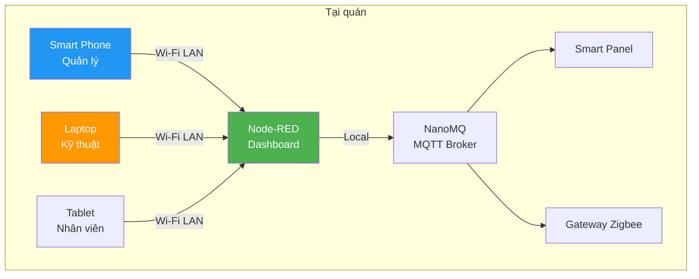
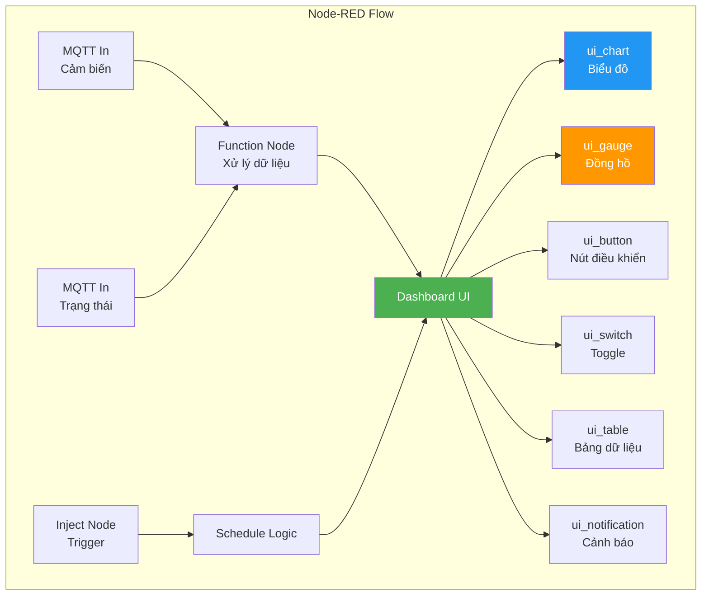
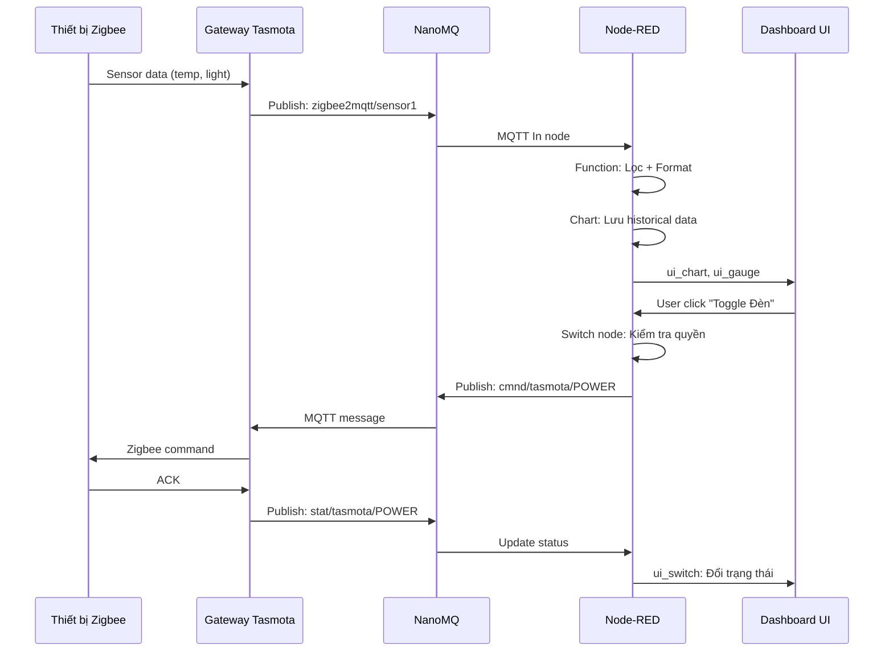

# Slide 10: Dashboard Node-RED — Quản lý Tại Chỗ Qua Web

# Giao diện Web Dashboard Cho Quản Lý & Kỹ Thuật

## Truy cập từ bất kỳ đâu trong quán, không cần cài app

---

## Vị trí và vai trò



- **Truy cập:** Mở trình duyệt, nhập IP local (vd: http://192.168.1.50:1880/ui)
- **Không cần cài đặt:** Chạy trên bất kỳ thiết bị nào có browser
- **Đối tượng:** Quản lý quán, Kỹ thuật viên khi đến kiểm tra

---

## Kiến trúc Node-RED Dashboard



### Tại sao Node-RED?

| Tiêu chí | Node-RED | Giải pháp khác |
|----------|----------|---------------|
| **Triển khai** | ✅ Cài sẵn trên Smart Panel | ❌ Cần server riêng |
| **Lập trình** | ✅ Kéo thả (low-code) | ❌ Cần dev viết code |
| **Tùy biến** | ✅ Dễ dàng thay đổi flow | ❌ Cần build lại |
| **MQTT native** | ✅ Hỗ trợ sẵn | ⚠️ Cần thư viện thêm |
| **Dashboard** | ✅ Có sẵn UI nodes | ❌ Cần viết frontend |
| **Debug** | ✅ Xem msg trực tiếp | ❌ Cần log file |

---

## Dashboard Tab 1: Tổng quan (Overview)

### Wireframe mô tả

```
┌─────────────────────────────────────────────────────────────┐
│  🏠 Smart Cafe Dashboard          [Quán A ▼]  [🔄 Refresh]  │
├─────────────────────────────────────────────────────────────┤
│  ┌────────────┐ ┌────────────┐ ┌────────────┐ ┌───────────┐ │
│  │   ⚡ Điện   │ │   💡 Đèn   │ │   ❄️ ĐH    │ │  🌞 Ánh    │ │
│  │  45.2 kWh  │ │  12/15 ON  │ │  2/3 ON    │ │  850 lux   │ │
│  │  Hôm nay   │ │  Tiết kiệm │ │  24°C avg  │ │  Tự nhiên  │ │
│  │  [chart]   │ │   25%      │ │  [gauge]   │ │  [gauge]   │ │
│  └────────────┘ └────────────┘ └────────────┘ └───────────┘ │
│                                                             │
│  📊 BIỂU ĐỒ TIÊU THỤ ĐIỆN (24H)                             │
│  ┌─────────────────────────────────────────────────────┐   │
│  │                                                     │   │
│  │    ╱╲       ╱╲          ╱╲         ╱╲              │   │
│  │   ╱  ╲     ╱  ╲        ╱  ╲       ╱  ╲    Điều hòa │   │
│  │  ╱    ╲   ╱    ╲      ╱    ╲     ╱    ╲            │   │
│  │ ╱      ╲_╱      ╲____╱      ╲___╱      ╲___        │   │
│  │_____________________________________________ Đèn    │   │
│  └─────────────────────────────────────────────────────┘   │
│                                                             │
│  🗺️ MAP VIEW: Trạng thái thiết bị theo khu vực              │
│  [Khu A: 🟢] [Khu B: 🟢] [Bếp: 🟡] [WC: 🟢] [Sân: 🔴]     │
└─────────────────────────────────────────────────────────────┘
```

### Widgets sử dụng

| Widget | Node | Dữ liệu | Cập nhật |
|--------|------|---------|----------|
| **Số liệu tóm tắt** | `ui_text` | kWh, số thiết bị ON | 5 phút |
| **Biểu đồ đường** | `ui_chart` | Tiêu thụ điện theo giờ | 15 phút |
| **Đồng hồ gauge** | `ui_gauge` | Nhiệt độ, ánh sáng | Real-time |
| **Map view** | `ui_button` (tùy biến) | Trạng thái theo khu vực | Real-time |

---

## Dashboard Tab 2: Điều khiển (Control)

### Wireframe mô tả

```
┌─────────────────────────────────────────────────────────────┐
│  🎛️ ĐIỀU KHIỂN THIẾT BỊ                                     │
├─────────────────────────────────────────────────────────────┤
│  💡 HỆ THỐNG ĐÈN                                            │
│  ┌─────────────────────────────────────────────────────┐   │
│  │ Thiết bị          │ Trạng thái │ Điều khiển         │   │
│  ├───────────────────┼────────────┼────────────────────┤   │
│  │ Đèn chính khu A   │ 🟢 ON      │ [⏻️ Toggle] [▓░░░]│   │
│  │ Đèn chính khu B   │ ⚪ OFF     │ [⏻️ Toggle] [░░░░]│   │
│  │ Đèn biển quảng cáo│ 🟢 ON      │ [⏻️ Toggle] [▓▓▓▓]│   │
│  │ Đèn WC            │ 🟢 ON      │ [⏻️ Toggle] [▓▓░░]│   │
│  └─────────────────────────────────────────────────────┘   │
│                                                             │
│  ❄️ HỆ THỐNG ĐIỀU HÒA                                       │
│  ┌─────────────────────────────────────────────────────┐   │
│  │ Thiết bị          │ Nhiệt độ   │ Chế độ  │ Điều khiển│   │
│  ├───────────────────┼────────────┼─────────┼───────────┤   │
│  │ ĐH Khu khách      │ 22°C       │ [Auto▼] │ [⏻️] [+][-]│   │
│  │ ĐH Khu bếp        │ OFF        │ [Off ▼] │ [⏻️] [+][-]│   │
│  │ ĐH Phòng VIP      │ 24°C       │ [Cool▼] │ [⏻️] [+][-]│   │
│  └─────────────────────────────────────────────────────┘   │
│                                                             │
│  [🚨 EMERGENCY STOP] [↩️ Khôi phục Auto]                    │
└─────────────────────────────────────────────────────────────┘
```

### Tương tác điều khiển

| Thao tác | Phản hồi | Thờigian |
|----------|----------|----------|
| **Toggle ON/OFF** | Nút đổi màu + trạng thái cập nhật | < 1 giây |
| **Slider độ sáng** | Giá trị % hiển thị real-time | Real-time |
| **Stepper nhiệt độ** | Nút +/- tăng giảm 1°C | < 1 giây |
| **Emergency Stop** | Tắt toàn bộ, yêu cầu xác nhận lại | Ngay lập tức |
| **Chuyển chế độ** | Dropdown: Auto / Manual / Timer | < 500ms |

---

## Dashboard Tab 3: Phân tích (Analytics)

### Wireframe mô tả

```
┌─────────────────────────────────────────────────────────────┐
│  📈 PHÂN TÍCH & BÁO CÁO                                     │
├─────────────────────────────────────────────────────────────┤
│  [Hôm nay] [7 ngày] [30 ngày] [Tùy chỉnh]                   │
│                                                             │
│  📊 TIÊU THỤ ĐIỆN THEO LOẠI THIẾT BỊ                       │
│  ┌─────────────────────────────────────────────────────┐   │
│  │                                                     │   │
│  │    ▓▓▓▓▓▓▓▓  Điều hòa (45%)                        │   │
│  │    ▓▓▓▓      Chiếu sáng (20%)                      │   │
│  │    ▓▓▓       Đèn biển (15%)                        │   │
│  │    ▓▓        Thiết bị khác (20%)                   │   │
│  └─────────────────────────────────────────────────────┘   │
│                                                             │
│  📉 SO SÁNH TIẾT KIỆM                                       │
│  ┌─────────────────────────────────────────────────────┐   │
│  │ Tháng này: ████████████████████ 1260 kWh           │   │
│  │ Tháng trước: ████████████████████████ 1800 kWh     │   │
│  │ Tiết kiệm: ▼ 30% (-540 kWh) ✅                     │   │
│  └─────────────────────────────────────────────────────┘   │
│                                                             │
│  📋 BẢNG XẾP HẠNG THEO GIỜ (Top tiêu thụ)                   │
│  ┌─────────────────────────────────────────────────────┐   │
│  │ 1. 14:00-15:00: 45 kWh (Giờ cao điểm)              │   │
│  │ 2. 12:00-13:00: 42 kWh (Giờ cao điểm)              │   │
│  │ 3. 20:00-21:00: 38 kWh (Giờ cao điểm)              │   │
│  └─────────────────────────────────────────────────────┘   │
└─────────────────────────────────────────────────────────────┘
```

### Dữ liệu phân tích

| Báo cáo | Dữ liệu | Giá trị |
|---------|---------|---------|
| **Phân bổ điện năng** | Pie/Bar chart theo loại thiết bị | Theo ngày/tuần/tháng |
| **So sánh thờigian** | Bar chart so sánh với kỳ trước | % tiết kiệm |
| **Top giờ tiêu thụ** | Bảng xếp hạng | Tối ưu lịch trình |
| **Xu hướng** | Line chart 30 ngày | Dự báo nhu cầu |

---

## Dashboard Tab 4: Cảnh báo & Log

### Wireframe mô tả

```
┌─────────────────────────────────────────────────────────────┐
│  🔔 CẢNH BÁO & LOG HỆ THỐNG                                 │
├─────────────────────────────────────────────────────────────┤
│  [Tất cả] [🔴 Cao] [🟡 Trung bình] [🟢 Thông tin]          │
│                                                             │
│  ┌─────────────────────────────────────────────────────┐   │
│  │ 🔴 14:25 | Gateway Quán A mất kết nối > 5 phút     │   │
│  │      Hành động: Kiểm tra nguồn điện Gateway        │   │
│  │      [✅ Đã xử lý] [📋 Chi tiết]                   │   │
│  ├─────────────────────────────────────────────────────┤   │
│  │ 🟡 13:10 | Cảm biến ánh sáng khu B pin yếu (15%)   │   │
│  │      Hành động: Lập lịch thay pin                   │   │
│  │      [⏳ Đang xử lý] [📋 Chi tiết]                  │   │
│  ├─────────────────────────────────────────────────────┤   │
│  │ 🟢 12:00 | Điều hòa tự động chuyển sang 24°C       │   │
│  │      Hành động: Automation hoạt động bình thường   │   │
│  │      [✅ Đã xem]                                   │   │
│  └─────────────────────────────────────────────────────┘   │
│                                                             │
│  [📥 Xuất CSV] [🗑️ Xóa log cũ] [⚙️ Cấu hình cảnh báo]    │
└─────────────────────────────────────────────────────────────┘
```

---

## Luồng dữ liệu trong Node-RED



---

## So sánh: Node-RED Dashboard vs Smart Panel LVGL

| Tiêu chí | Smart Panel (LVGL) | Node-RED Dashboard |
|----------|-------------------|-------------------|
| **Ngườidùng** | Nhân viên quán | Quản lý, Kỹ thuật |
| **Thiết bị** | Màn hình cảm ứng gắn tường | Phone, laptop, tablet bất kỳ |
| **Truy cập** | Tại chỗ, trực tiếp | Wi-Fi LAN, từ xa trong quán |
| **Chức năng chính** | Điều khiển nhanh, cảnh báo | Phân tích, báo cáo, cấu hình |
| **Hiển thị** | Đơn giản, ít text | Chi tiết, nhiều chart |
| **Tùy biến** | Cần build C++ | Kéo thả node, dễ thay đổi |
| **Offline** | ✅ Hoàn toàn local | ✅ Chạy local trên Smart Panel |

---

## Thông điệp

> *"Node-RED Dashboard chạy ngay trên Smart Panel, không cần server cloud. Quản lý có thể mở trình duyệt trên điện thoại để xem biểu đồ tiêu thụ điện, kỹ thuật có thể cấu hình automation từ laptop mà không cần cài đặt phần mềm."*

---

## Thông số kỹ thuật

| Thông số | Giá trị |
|----------|---------|
| **URL truy cập** | http://[IP-SmartPanel]:1880/ui |
| **Framework** | Node-RED + node-red-dashboard |
| **Port** | 1880 (editor), 1880/ui (dashboard) |
| **MQTT broker** | NanoMQ (localhost:1883) |
| **Authentication** | Username/password (có thể cấu hình) |
| **Responsive** | ✅ Tự động co giãn theo màn hình |

